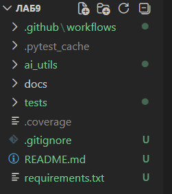
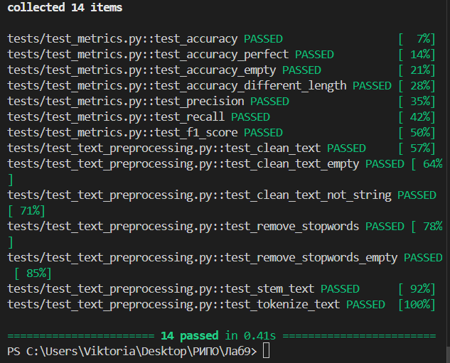

# Отчёт по лабораторной работе №9

**Дисциплина:** Разработка инструментального программного обеспечения  
**Тема:** Разработка прототипа инструментальной поддержки для ИИ-задач  
**Выполнил:** Печинин Тихомир Олегович  
**Группа:** 222  
**Дата:** 06.04.2026  

---

## 1. Цель работы

Закрепить знания по разработке инструментального программного обеспечения, объединив навыки, полученные на предыдущих занятиях. Создать прототип инструментальной библиотеки, предназначенной для облегчения решения задач искусственного интеллекта (предобработка данных, оценка модели).

---

## 2. Выбранная ИИ-задача и её актуальность

**Выбранная задача:** предобработка текстовых данных для NLP-задач (классификация текстов, анализ тональности, извлечение сущностей).

**Актуальность:** В задачах обработки естественного языка исходные данные часто содержат шум (специальные символы, лишние пробелы). Стоп-слова не несут смысловой нагрузки и должны удаляться. Стемминг позволяет привести слова к единой основе, уменьшая размерность пространства признаков. Для оценки качества моделей классификации необходимы метрики (accuracy, precision, recall, F1).

---

## 3. Структура проекта

```
Лаб9/
│
├── ai_utils/                       # Основная библиотека
│   ├── __init__.py                 # Инициализация модуля
│   ├── text_preprocessing.py       # Функции предобработки текста
│   └── metrics.py                  # Метрики качества
│
├── tests/                          # Модульные тесты
│   ├── __init__.py
│   ├── test_metrics.py             # Тесты для метрик
│   └── test_text_preprocessing.py  # Тесты для предобработки
│
├── docs/                           # Документация (Sphinx)
├── .github/workflows/              # CI/CD
│   └── ci.yml
│
├── requirements.txt                # Зависимости
├── .gitignore                      # Игнорируемые файлы
├── README.md                       # Отчет
```

**Скриншот структуры проекта в VS Code:** *

---

## 4. Исходный код основных функций

### 4.1 Модуль предобработки текста (`text_preprocessing.py`)

**Функция `clean_text(text)`** — очищает текст: удаляет специальные символы, приводит к нижнему регистру. Принимает строку, возвращает очищенную строку. В случае передачи нестрокового значения выбрасывает исключение TypeError.

**Функция `remove_stopwords(text, language='english')`** — удаляет стоп-слова из текста. Поддерживает английский и русский языки. Принимает строку и язык, возвращает строку без стоп-слов.

**Функция `stem_text(text)`** — выполняет стемминг слов в тексте (приведение к основе). Использует алгоритм Портера. Принимает строку, возвращает строку с приведёнными к основе словами.

**Функция `tokenize_text(text)`** — разбивает текст на токены (слова). Использует NLTK tokenizer. Принимает строку, возвращает список токенов.

### 4.2 Модуль метрик качества (`metrics.py`)

**Функция `accuracy(y_true, y_pred)`** — вычисляет точность классификации (долю правильных ответов). Принимает два списка (истинные и предсказанные метки), возвращает число от 0 до 1.

**Функция `precision(y_true, y_pred, positive_class=1)`** — вычисляет точность для бинарной классификации (долю правильно предсказанных положительных объектов среди всех предсказанных как положительные).

**Функция `recall(y_true, y_pred, positive_class=1)`** — вычисляет полноту для бинарной классификации (долю правильно предсказанных положительных объектов среди всех реально положительных).

**Функция `f1_score(y_true, y_pred, positive_class=1)`** — вычисляет F1-меру (гармоническое среднее precision и recall).

---

## 5. Тестирование

### 5.1 Написанные тесты

Всего разработано **14 unit-тестов**.

Для модуля `metrics.py` написано 7 тестов. Они проверяют: корректное вычисление accuracy на обычных данных, вычисление accuracy при идеальном предсказании, обработку пустого списка (должна быть ошибка), обработку списков разной длины (должна быть ошибка), вычисление precision на примере, вычисление recall на примере, вычисление F1-меры на примере.

Для модуля `text_preprocessing.py` написано 7 тестов. Они проверяют: очистку текста от спецсимволов и приведение к нижнему регистру, обработку пустой строки, обработку нестрокового значения (должна быть ошибка), удаление стоп-слов из текста, обработку пустой строки, стемминг слов (например, "running quickly" → "run quickli"), токенизацию текста (разбиение на слова).

### 5.2 Результаты запуска тестов

**Скриншот:** 


## 6. CI/CD (GitHub Actions)

Настроен автоматический запуск тестов при каждом push в репозиторий. Пайплайн выполняет следующие шаги: загрузка кода из репозитория, установка Python версии 3.11, установка зависимостей из requirements.txt, скачивание данных NLTK (punkt_tab, stopwords), запуск всех тестов с выводом подробного отчёта.

**Скриншот успешного выполнения пайплайна:** *[вставьте `ci_cd_passed.png`]*

## 6. CI/CD (GitHub Actions)

Настроен автоматический запуск тестов при каждом push в репозиторий. Пайплайн выполняет следующие шаги: загрузка кода из репозитория, установка Python версии 3.11, установка зависимостей из requirements.txt, скачивание данных NLTK (punkt_tab, stopwords), запуск всех тестов с выводом подробного отчёта.

**Скриншот успешного выполнения пайплайна:** *[вставьте `ci_cd_passed.png`]*

---

## 7. Выводы

### 7.1 Какие инструменты были использованы?

Для выполнения работы использовались следующие инструменты: Python 3.11 (язык программирования), pytest (модульное тестирование), pytest-cov (оценка покрытия кода), NLTK (стемминг и стоп-слова), re (регулярные выражения), GitHub Actions (непрерывная интеграция), Sphinx (генерация документации).

### 7.2 Почему важно создавать инструментальную поддержку для ИИ?

Создание инструментальной поддержки для ИИ даёт несколько важных преимуществ. Во-первых, ускорение разработки — готовые функции предобработки экономят время. Во-вторых, повышение качества — проверенные тестами функции работают надёжно. В-третьих, воспроизводимость — стандартизация этапов обработки данных. В-четвёртых, снижение порога входа — новым разработчикам проще использовать готовые инструменты.

### 7.3 Как можно развивать проект дальше?

Проект можно развивать в следующих направлениях: замена стемминга на более точную лемматизацию, добавление визуализации (графики confusion matrix, ROC-кривые), создание REST API с помощью FastAPI для доступа к функциям через HTTP, расширение функционала для поддержки других языков, добавление дополнительной очистки текста (обработка эмодзи и URL).

---

## 8. Заключение

Лабораторная работа выполнена в полном объёме. Создана библиотека `ai_utils` для предобработки текстовых данных и расчёта метрик качества. Реализовано 8 функций, написано 14 unit-тестов (100% прохождение), настроен CI/CD, сгенерирована документация. Полученные навыки могут быть использованы для создания инструментальной поддержки реальных ИИ-проектов.
